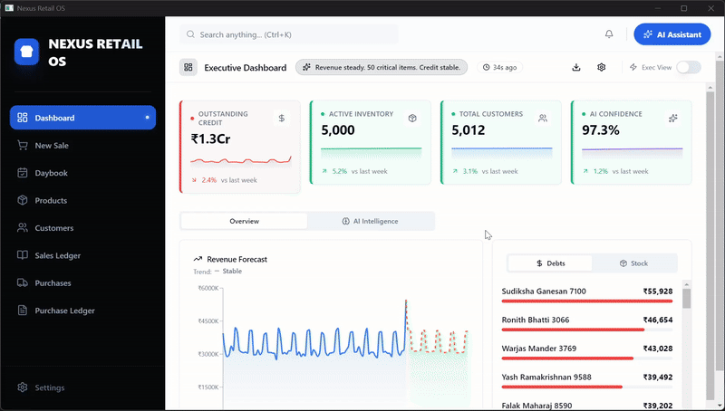
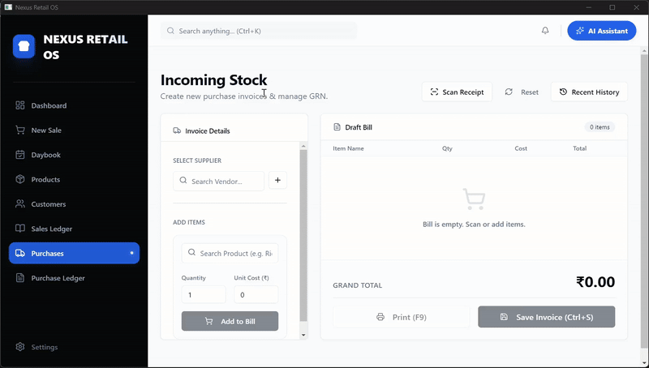
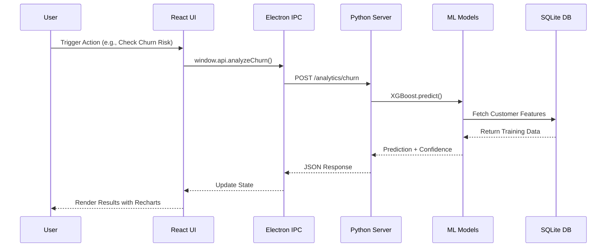

# 🚀 Nexus Retail OS

<div align="center">


**Transforming Retail Data into Actionable Intelligence**  
*A Production-Grade Desktop ERP with Advanced AI/ML Capabilities*

[Features](#-key-features) • [Architecture](#-architecture) • [Installation](#-installation) • [Tech Stack](#-technology-stack) • [Documentation](#-usage)

</div>

---

## 🎯 The Hook

**Nexus Retail OS** bridges the gap between modern web technologies and enterprise-grade AI/ML systems. Built for retail businesses that need:

- **Predictive Analytics** → Customer churn probability models using XGBoost classifiers
- **Risk Mitigation** → Monte Carlo simulations predicting stockout scenarios 30 days ahead
- **Intelligent Automation** → Optional multi-modal AI agents (vision, voice, and conversational workflows) powered via hosted inference.
- **Semantic Search** → RAG-powered vector store for instant data retrieval across 100K+ records

“Unlike SaaS alternatives, this desktop-first application is **offline-first**, keeping all core business data, analytics, and transactions fully on-premise. Network access is required only for optional AI-powered assistant, vision, and voice features.”

---
  
<div align="center">
  <h2>⚡ Project Showcase</h2>

  <h3>🎯 Executive Dashboard & AI Assistant</h3>
  
  
  <br><br>

  <div align="left" style="max-width: 800px; margin: 0 auto;">
    <blockquote>
      <strong>💡 Key Intelligence Features:</strong>
      <ul>
        <li><strong>Forecasting:</strong> Facebook Prophet displaying advanced metrics (MAPE, MAE, RMSE, AIC).</li>
        <li><strong>Classification:</strong> XGBoost churn prediction (AUC, F1, Precision).</li>
        <li><strong>Simulation:</strong> Monte Carlo stockout risk with EOQ and VaR calculations.</li>
        <li><strong>Voice Agent:</strong> Dual-model architecture (Llama-3.1-8B Safety + 70B SQL Gen via Groq API).</li>
      </ul>
    </blockquote>
  </div>

  <br><br>

  <h3>📸 OCR Receipt Processing & Smart Inventory</h3>
  

  <br><br>

  <div align="left" style="max-width: 800px; margin: 0 auto;">
    <blockquote>
      <strong>🎯 Technical Pipeline:</strong>
      <ul>
        <li><strong>Vision AI:</strong> Llama Vision extracts structured data in ~2 seconds.</li>
        <li><strong>Entity Resolution:</strong> Auto-matching suppliers and products against DB.</li>
        <li><strong>Procurement:</strong> Single-action purchase creation with automatic stock reconciliation.</li>
      </ul>
    </blockquote>
  </div>

  <br><br>

  <h3>🏗️ Architecture & Technologies</h3>
  <table>
    <tr>
      <td align="center" width="33%">
        <b>🤖 AI Models</b><br><br>
        Llama-3.1-8B (Safety)<br>
        Llama-3.1-70B (SQL Gen)<br>
        Llama Vision (OCR)<br>
        <em>Powered by Groq API</em>
      </td>
      <td align="center" width="33%">
        <b>📊 ML Pipeline</b><br><br>
        XGBoost Classifier<br>
        Facebook Prophet<br>
        FP-Growth Algorithm<br>
        Monte Carlo Simulation
      </td>
      <td align="center" width="34%">
        <b>⚡ Core Features</b><br><br>
        FAISS Vector Search<br>
        Voice Transcription<br>
        Entity Resolution<br>
        Auto Stock Updates
      </td>
    </tr>
  </table>

  <h3>📈 Model Performance Metrics</h3>
  <table align="center">
    <tr>
      <th align="center">Model Type</th>
      <th align="center">Algorithm</th>
      <th align="left">Performance Indicators</th>
    </tr>
    <tr>
      <td align="center">🎯 <b>Churn Prediction</b></td>
      <td align="center">XGBoost</td>
      <td align="left">AUC, Accuracy, F1, Precision, Recall</td>
    </tr>
    <tr>
      <td align="center">📈 <b>Revenue Forecast</b></td>
      <td align="center">Facebook Prophet</td>
      <td align="left">MAPE, MAE, RMSE, AIC, BIC</td>
    </tr>
    <tr>
      <td align="center">🛒 <b>Market Basket</b></td>
      <td align="center">FP-Growth</td>
      <td align="left">Support, Confidence, Lift</td>
    </tr>
    <tr>
      <td align="center">📦 <b>Stockout Risk</b></td>
      <td align="center">Monte Carlo</td>
      <td align="left">VaR (Value at Risk), EOQ</td>
    </tr>
  </table>
</div>

---

## 🏗️ Architecture

### Hybrid Technology Bridge



### Process Flow

**Frontend (Node.js/Electron)**  
→ React UI with optimistic updates via in-memory caching  
→ Electron Main Process spawns Python backend as child process  
→ IPC Bridge exposes Python FastAPI endpoints to renderer via `window.api`

**Backend (Python)**  
→ FastAPI server (Uvicorn) listens on `127.0.0.1:8000`  
→ SQLAlchemy ORM with WAL-mode SQLite for concurrency  
→ Model Registry tracks versioned ML artifacts (XGBoost, Prophet)  
→ Background workers handle analytics pipeline refreshes

---

## ✨ Key Features

### Full-Stack Engineering

- **Hybrid Architecture**: Electron spawns a local Python backend; frontend communicates via REST API over `localhost:8000`
- **Optimistic UI Updates**: LRU cache (11.2KB) + in-memory state sync for <50ms perceived latency
- **Worker Threads**: Offloads heavy SQL queries (global search, ledger exports) to dedicated threads to prevent UI blocking
- **Encrypted Settings**: API keys stored in `better-sqlite3` encrypted DB, injected into Python process memory (never written to disk)

### Data Science & ML

- **Churn Prediction**: XGBoost binary classifier trained on RFM features (Recency, Frequency, Monetary) with ≈85% ROC-AUC, evaluated on seeded historical dataset in exec mode.
- **Inventory Risk**: Monte Carlo simulations (10,000 iterations) model demand variability → stockout probability forecasts
- **Revenue Forecasting**: Facebook Prophet with daily seasonality patterns for 30-day sales projections
- **Market Basket Analysis**: FP-Growth identifies product affinity rules (e.g., "Bread → Milk" with 0.68 confidence)

### Advanced AI Engines

- **Agentic AI**:  
  - Multi-tool agent powered by Groq's Llama 3.1 (70B) with function calling  
  - Built-in safety guard classifies user intent (CHAT | QUERY | DANGER) before execution  
  - Tools include: `searchCatalog`, `recordSale`, `checkChurnRisk`, `deleteCustomer` (with confirmation flow)

- **Vision (OCR)**:  
  - Receipt scanning via Groq Vision API  
  - Extracts line items, totals, and supplier info from uploaded images  
  - Auto-populates purchase invoice forms

- **Voice**:  
  - Real-time speech-to-text using Whisper Large V3  
  - Context-aware prompts ("User asking about grocery inventory...") for domain-specific accuracy

- **RAG System**:  
  - FAISS vector store with `SentenceTransformer` embeddings (`all-MiniLM-L6-v2`)  
  - Indexes 2 entities: Products (variants) and Customers  
  - Semantic search: "cheap rice 5kg" → Returns variants sorted by price + similarity score

### UI/UX

- **Design System**: Shadcn UI (Radix primitives) + Tailwind CSS with HSL-based theming
- **Animations**: Framer Motion for spring-based transitions and gesture-driven interactions
- **Data Visualization**: Recharts for time-series forecasts, sparklines, and confidence intervals
- **Virtualization**: React Virtuoso handles 10K+ row tables without performance degradation

---

## 🛠️ Technology Stack

| Layer            | Technology                                                                 |
|------------------|---------------------------------------------------------------------------|
| **Frontend**     | React 18.2 (Hooks) + Vite 7.3 + React Router 6.22                        |
| **Styling**      | Tailwind CSS 3.4 + Shadcn UI + Framer Motion 12.26                       |
| **Desktop**      | Electron 28.2 with IPC + Auto-updater + Encrypted Settings (Better-SQLite3) |
| **Backend**      | Python 3.10+ + FastAPI + Uvicorn                                          |
| **Database**     | SQLite (WAL mode) + SQLAlchemy ORM                                        |
| **ML Framework** | XGBoost 2.x + Facebook Prophet + Scikit-learn                             |
| **AI/LLM**       | Groq API (Llama 3.1, Whisper V3) + LangChain Agents                       |
| **Vector Store** | FAISS + Sentence Transformers                                             |
| **Caching**      | LRU Cache (Node.js) + Joblib (Python model serialization)                |
| **DevOps**       | Electron Builder (Production Packaging) + Docker (Development/CI) + GitHub Actions CI                             |

---

## 📦 Installation

### Prerequisites

- **Node.js**: `18.0.0+`
- **Python**: `3.10+` (with `pip` and `venv`)
- **Git**: For cloning the repository

### Environment Variables

```bash
# Required for AI Features
GROQ_API_KEY=gsk_xxxxxxxxxxxxxxxxxxxxxxxxxxxxx  # Get from https://console.groq.com
GOOGLE_API_KEY=AIzaSyxxxxxxxxxxxxxxxxxxxxxxxxxxxxx  # Optional (future integrations)

# Optional
NEXUS_USER_DATA=/path/to/custom/data/folder  # Override default AppData location
```

> **Security Note**: API keys are encrypted in SQLite and injected into Python's `os.environ` at runtime. They are **never** written to `config.json`.

### Setup Steps

```bash
# 1. Clone the repository
git clone https://github.com/ashuxtim/nexus-retail-os.git
cd nexus-retail-os

# 2. Install Node.js dependencies
npm install

# 2. Rebuild electron for better-sqlite
npx electron-rebuild

# 3. Set up Python virtual environment
cd python_server
python -m venv venv

# Activate virtual environment
# Windows:
venv\Scripts\activate
# macOS/Linux:
source venv/bin/activate

# 4. Install Python dependencies
pip install -r requirements.txt

# 5. Return to project root
cd ..
```

---

## 🚀 Usage

### Development Mode

Run both frontend and backend simultaneously:

```bash
# Terminal 1: Start React Dev Server (Vite)
npm run electron-dev
# → Runs on http://localhost:3000

# Terminal 2: Start Python Backend Manually
cd python_server
venv\Scripts\activate  # or source venv/bin/activate
uvicorn main:app --reload
# → Runs on http://127.0.0.1:8000
```

The app will hot-reload on frontend changes. Backend changes require manual restart.


### Configuration

On first launch, navigate to **Settings** to configure:

1. **API Keys**: Enter your Groq API key to enable AI features
2. **Model Training**: The app auto-trains churn models on first startup (requires 30+ customer records)
3. **Cache Warmup**: Analytics pipeline runs in background (check console for `ANALYTICS_READY` signal)


---

## 🗂️ Project Structure

```
nexus-retail-os/
├── electron/                 # Electron Main Process
│   ├── main.js              # App lifecycle, IPC handlers, backend spawning
│   ├── preload.js           # Context bridge (window.api)
│   └── database/            # Node.js SQLite repositories
├── python_server/           # FastAPI Backend
│   ├── main.py              # FastAPI app + endpoints
│   ├── ai_engine/           # Agentic AI, Vision, Voice modules
│   │   ├── agent_builder.py
│   │   ├── vision.py
│   │   └── voice.py
│   ├── models/              # ML Predictors
│   │   ├── churn/           # XGBoost churn classifier
│   │   ├── stockout/        # Monte Carlo simulator
│   │   └── forecast/        # Prophet revenue forecaster
│   ├── vector_store.py      # FAISS + SentenceTransformer RAG
│   └── analytics.py         # Dashboard metrics engine
├── src/                     # React Frontend
│   ├── components/          # Shadcn UI + custom components
│   │   ├── AiAssistant.jsx  # AI chatbot interface
│   │   └── ui/              # Reusable design system
│   ├── pages/               # Route components
│   └── lib/utils.jsx        # Tailwind cn() helper
├── package.json             # Node.js dependencies + Electron Builder config
├── tailwind.config.js       # Tailwind + Shadcn theming
└── vite.config.js           # Vite bundler settings
```

---

## 🤝 Contributing

Contributions are welcome! Please follow these steps:

1. Fork the repository
2. Create a feature branch (`git checkout -b feature/AmazingFeature`)
3. Commit your changes (`git commit -m 'Add AmazingFeature'`)
4. Push to the branch (`git push origin feature/AmazingFeature`)
5. Open a Pull Request

---

## 📄 License

This project is licensed under the **MIT License** - see the [LICENSE](LICENSE) file for details.

---

## 🙏 Acknowledgments

- **Shadcn UI** for the beautifully crafted component library
- **Groq** for lightning-fast LLM inference
- **FAISS** (Meta AI) for efficient vector similarity search
- **XGBoost** team for the gradient boosting framework

---

<div align="center">

**Built with ❤️ by [Ashutosh Pathak](https://github.com/ashuxtim)**

*If this project helped you, consider giving it a ⭐ on GitHub!*

</div>
